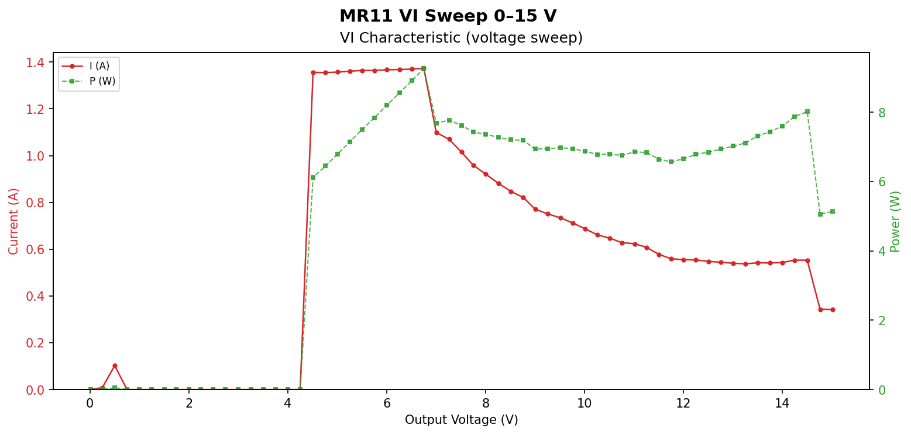
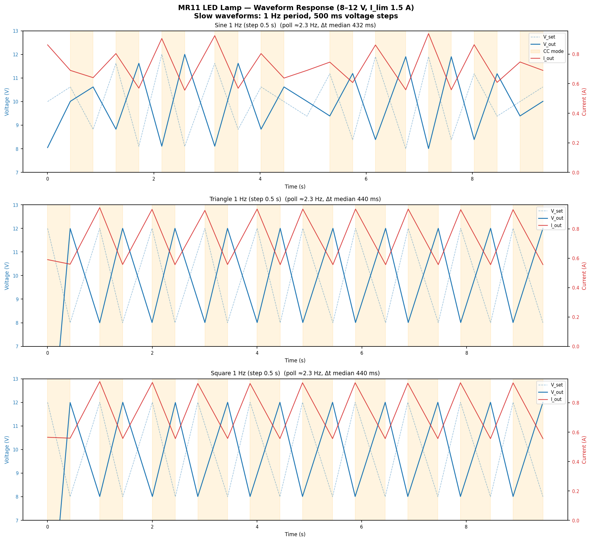
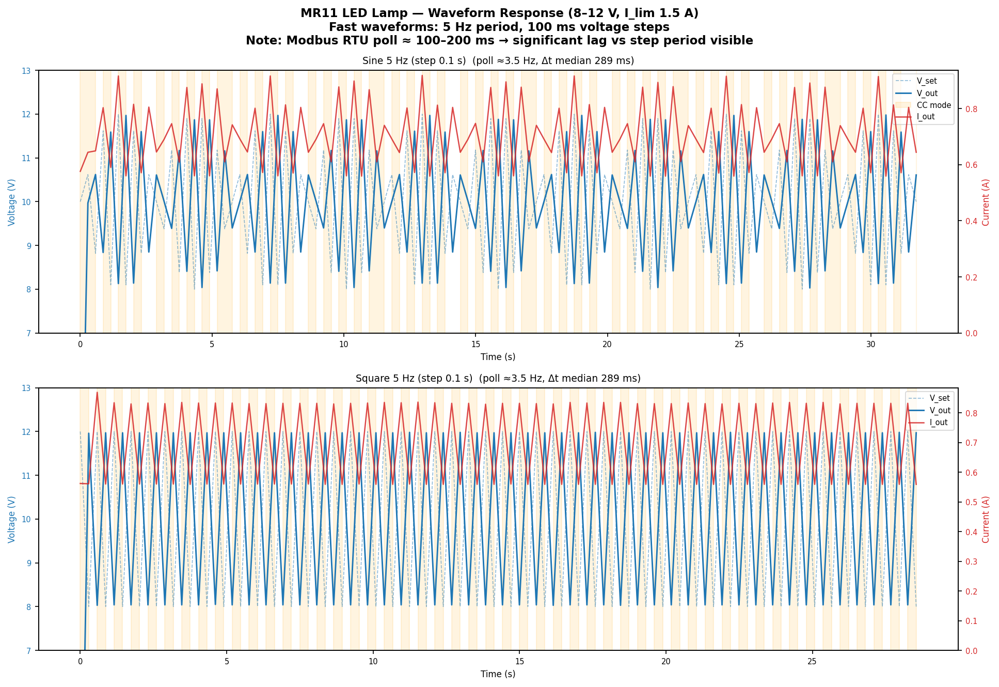

# awto-mcp-riden

> **Authorship:** Human-directed, AI-implemented.
> Architecture and decisions by Dan (awto-au); all code written by GitHub Copilot (Claude Sonnet 4.6).

MCP server for controlling RuiDeng / Riden power supplies (RD6006 / RD6012 / RD6018 / RD6024 / RK6006) from Copilot, Claude, or any MCP-capable agent.

Built on [awto-au/Riden](https://github.com/awto-au/Riden) (our fork of [ShayBox/Riden](https://github.com/ShayBox/Riden)), vendored into this repo — no external `riden` pip dependency.
See [ATTRIBUTION.md](ATTRIBUTION.md) for full lineage and [docs/design-notes.md](docs/design-notes.md) for the original design rationale.

---

## What this provides

Control a Riden bench PSU directly from an AI agent conversation:

- Set voltage, current, OVP, OCP
- Enable/disable output, power-cycle
- Stream live V+I logs (threshold-filtered, efficient)
- VI sweep characterisation (0 → N volts, records load curve)
- Inrush capture (fast poll during start-up)
- Waveform generation (sine / triangle / sawtooth / square)
- Direct Modbus register read/write (raw access)
- Firmware version check with known-latest table

### Example output — MR11 LED lamp VI sweep (0–15 V)



The lamp's LED driver is **constant-power** above ~7 V (~7 W), with turn-on at ~4.3 V and OVP-style rolloff at 14.75 V.

---

## Quick start

```bash
git clone https://github.com/awto-au/awto-mcp-riden
cd awto-mcp-riden
python3 -m venv .venv && source .venv/bin/activate
pip install -e .

# CLI smoke test
python3 ttu_cli.py --port /dev/ttyUSB0 status
```

Register in VS Code via `.vscode/mcp.json` — then ask Copilot:
> *"What's the PSU output voltage?"* → calls `rd_status`
> *"Sweep 0–15 V and plot the load curve"* → calls `rd_vsweep` + `rd_plot_results`

---

## MCP tool reference

### Status & identity

| Tool | Description |
|---|---|
| `rd_status()` | Voltage, current, power, temp, CV/CC mode, protection state |
| `rd_firmware()` | Model, device ID, serial, firmware version, up-to-date flag |
| `rd_list_psus()` | All registered PSUs, ports, connection state |
| `rd_list_parameters()` | Model/firmware-supported parameters |
| `rd_capabilities()` | Full capability report for connected model |

### Control

| Tool | Description |
|---|---|
| `rd_set_voltage(volts)` | Set output voltage |
| `rd_set_current(amps)` | Set current limit |
| `rd_output(on)` | Enable / disable output |
| `rd_set_ovp(volts)` | Over-voltage protection threshold |
| `rd_set_ocp(amps)` | Over-current protection threshold |
| `rd_power_cycle(seconds)` | Output off → wait → on |
| `rd_beep(on)` | Buzzer (model-dependent) |
| `rd_all_off()` | Emergency stop — all PSUs off |

### Logging

| Tool | Description |
|---|---|
| `rd_log_current(path, interval_ms, v_thresh, i_thresh)` | Fast V+I log, threshold-filtered |
| `rd_log_status(path, interval_ms)` | Full status log |
| `rd_log_stop()` | Stop logging — returns summary (samples, duration, peak/avg I, Wh) |
| `rd_log_retrieve(path, max_rows)` | Peek at log stats without stopping; optional downsampled rows |

> **Threshold filtering:** `rd_log_current` only writes a row when V or I changes beyond `v_thresh` / `i_thresh`. Steady-state 12 V / 0.55 A writes nothing — files stay small.

### Characterisation

| Tool | Description |
|---|---|
| `rd_vsweep(v_max, v_step, max_current, dwell_ms, path)` | VI sweep — records load curve 0 → v_max |
| `rd_inrush_capture(voltage, max_current, duration_s, path)` | Fast inrush capture at fixed voltage |
| `rd_plot_results(vsweep_path, inrush_path, current_log_path, out_png, title)` | Plot sweep + inrush + waveform log to PNG |

#### Example — MR11 lamp waveform response (8–12 V, I_lim 1.5 A)

Slow waveforms (1 Hz, 500 ms steps) — poll rate ≈ 2.3 Hz, Δt median ≈ 440 ms:



Fast waveforms (5 Hz, 100 ms steps) — Modbus RTU round-trip dominates, actual Δt ≈ 290 ms:



The orange shading marks **CC mode** (current-limiting). The gap between dashed V_set and solid V_out reflects register round-trip latency (~290–440 ms over USB). At 5 Hz the PSU cannot keep up with step timing; the Nyquist limit for useful V_out capture is roughly 1–2 Hz.

### Waveforms

| Tool | Description |
|---|---|
| `rd_waveform(shape, v_center, v_amplitude, freq_hz, duration_s, step_s)` | Sine / triangle / sawtooth / square |
| `rd_sine_wave(v_center, v_amplitude, freq_hz, duration_s, step_s)` | Sine shorthand |

### Raw Modbus

| Tool | Description |
|---|---|
| `rd_modbus_read_holding(start_register, count)` | FC03 read holding registers |
| `rd_modbus_write_register(register, value)` | FC06 write single register |

### Multi-PSU

| Tool | Description |
|---|---|
| `rd_connect(psu)` | Open serial for a named PSU |
| `rd_disconnect(psu)` | Close serial |

---

## CLI usage

```bash
python3 ttu_cli.py --port /dev/ttyUSB0 [--baud 115200] [--address 1] <command>

Commands:
  status          Current V/I/P/temp/mode
  capabilities    Model/firmware capabilities
  set-voltage V   Set output voltage
  set-current A   Set current limit
  output on|off   Enable/disable output
  ovp V           Set OVP threshold
  ocp A           Set OCP threshold
  info            Worker diagnostics + op counters
```

---

## Architecture

```
Copilot / Claude / agent
        │
   MCP stdio (JSON)
        │
   mcp_server.py          FastMCP, 20+ tools
        │
   riden_daemon.py        RidenWorker — thread-safe PSU wrapper
        │
   riden_transport.py     SerialTransport (modbus-tk + pyserial)
        │
   riden_register.py      Register address constants
        │
   Modbus RTU / USB serial
        │
   Riden RD/RK PSU
```

**No external `riden` package** — transport is fully vendored. See [ATTRIBUTION.md](ATTRIBUTION.md).

---

## Project philosophy

- One command in, one validated status out.
- Bounded retries — never recursive, never hangs forever.
- Safety by default: status-first, explicit output control.
- Transport explicit at runtime (`/dev/ttyUSB0`, `/dev/rfcomm0`, etc.).


---
